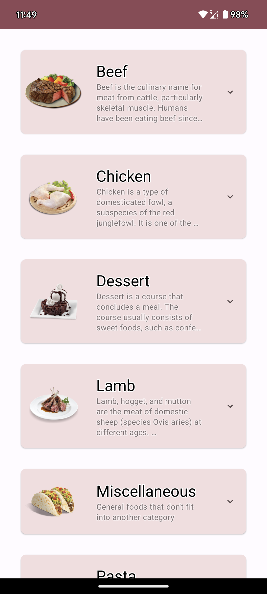
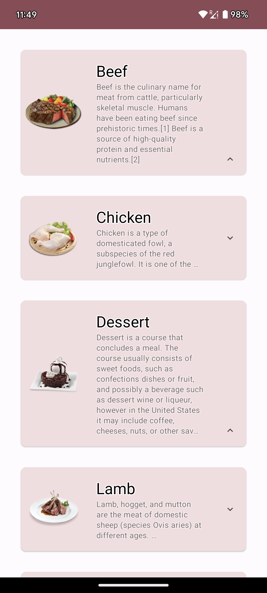
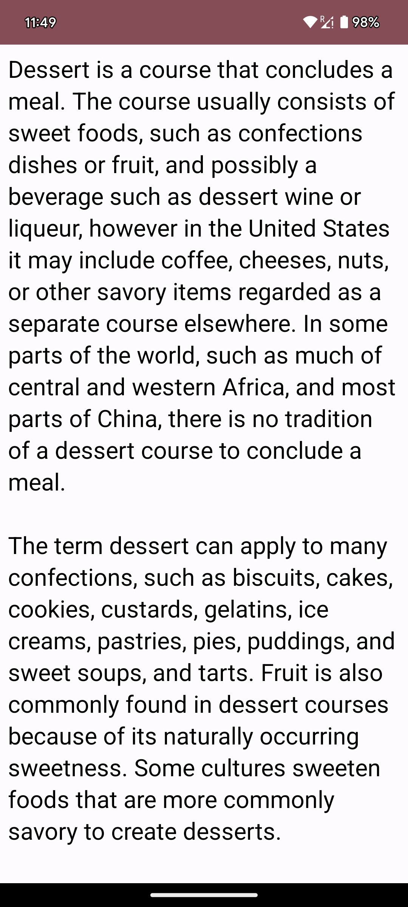

# List all meal categories
# Description

This is a native Android mobile app that utilizes the themealdb API to showcase a variety of meals. 
The app features a list of meal categories, each accompanied by an image and additional details. 
Users can expand the list by tapping on the chevron icon, revealing more information directly on the home screen. 
Upon selecting a specific meal from the list, users are redirected to a separate page where they can explore further details about the selected meal.

API's used
1. https://www.themealdb.com/api/json/v1/1/categories.php

# Libraries Used
* Retrofit - Retrofit as a REST Client library
* Gson - Gson converter as a Retrofit response mapping library
* Hilt - Dependency injection
* Navigation - Jetpack's navigation component

# Android components
* Compose - UI created using compose
* Coroutines – For Asynchronous or non-blocking programming
* Flow - Handle streams of data asynchronously

# Android Architecture Components (Android Jetpack)
* ViewModel - Allows data to survive configuration changes such as screen rotations.
* AndroidX - Complete project implemented using AndroidX libraries.

# Design
* The application is developed with TDD and MVVM design patterns.

# Further enhancements
* Support offline view
* Furthermore cosmetics and refactoring is an endless thought.

# Snapshots

